# 낚린이

## 1. 주제 및 기획의도
- **주제** 

  : 안드로이드 기반 낚시 정보제공 어플리케이션

- **기획의도** 

  : 낚시터와 낚시포인트, 날씨와 어종에 대한 정보를 제공해주는 앱 서비스 개발

- **동기**

  : 기존에 있던 낚시 앱에 초보자를 위한 팁과 물고기 사진을 찍으면 어종정보를 알려주는 기능을 위주로 하는 낚시 입문자용 앱을 개발

- **지원하는 기능들**

  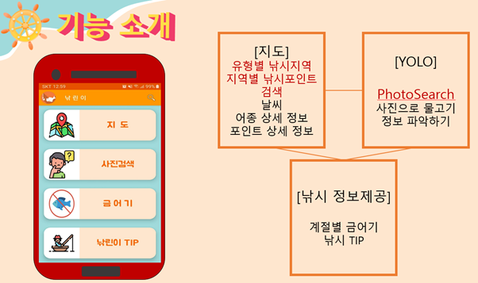

## 2. 시스템 구조 & 개발환경

  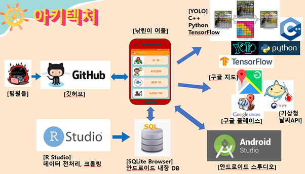

## 3. ERD 설계

- 전체 ERD

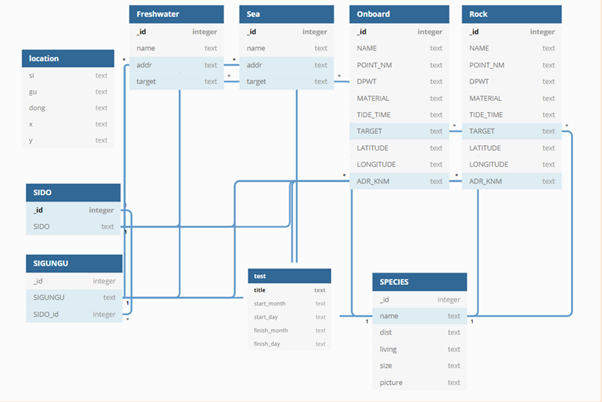

- 내가 맡은 테이블 ERD

  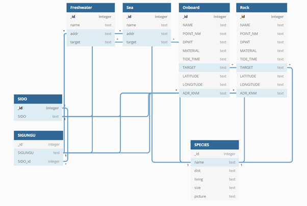

## 4. 캡처(맡은 부분)
  - 낚시 포인트 DB설계 및 데이터 전처리, 어종 DB 설계 및 데이터 전처리

  - 캡처

    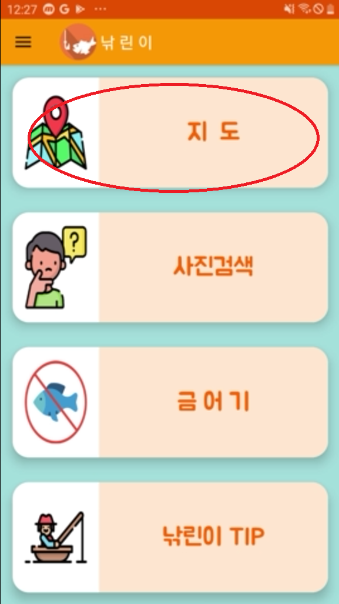
    
    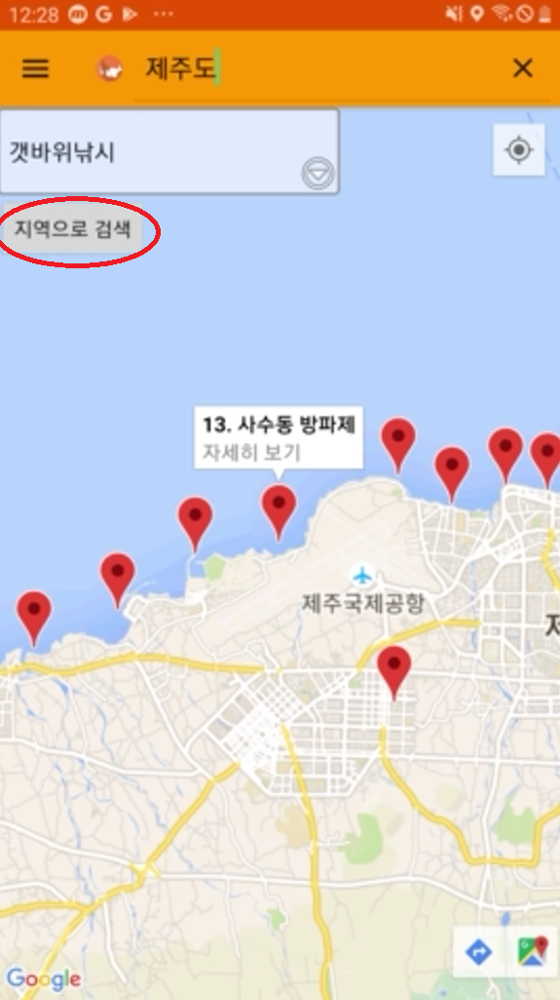
    
    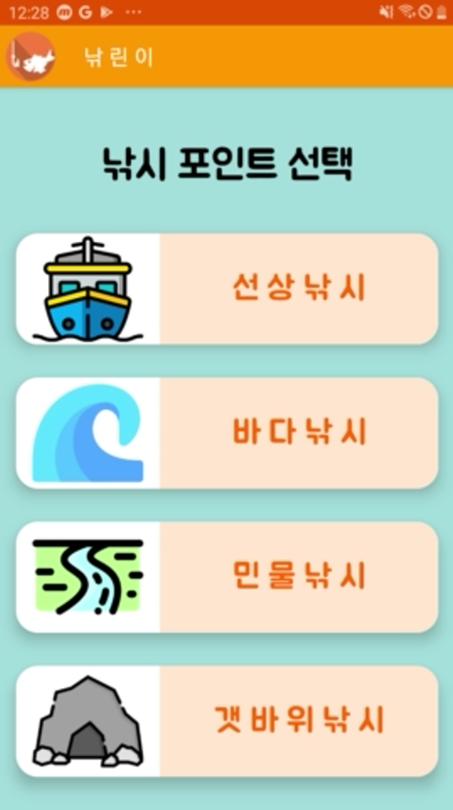
    
    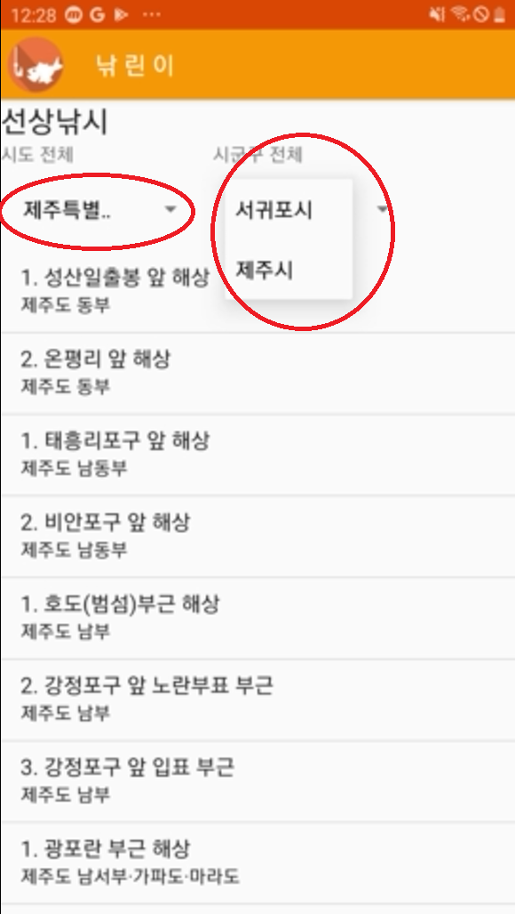
    
    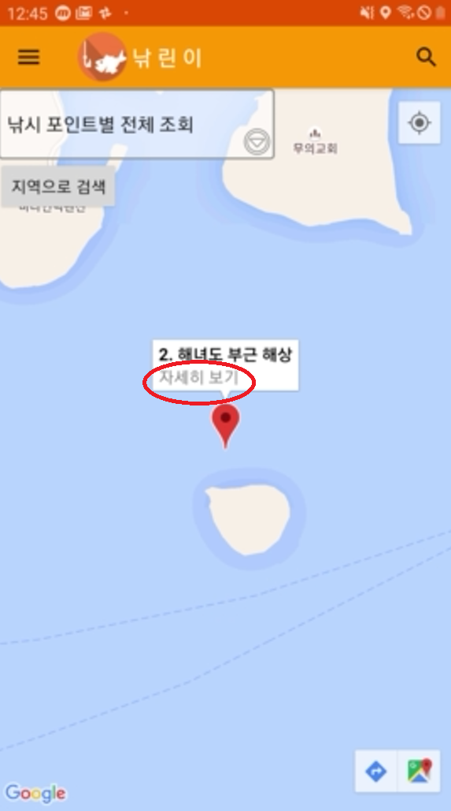
    
    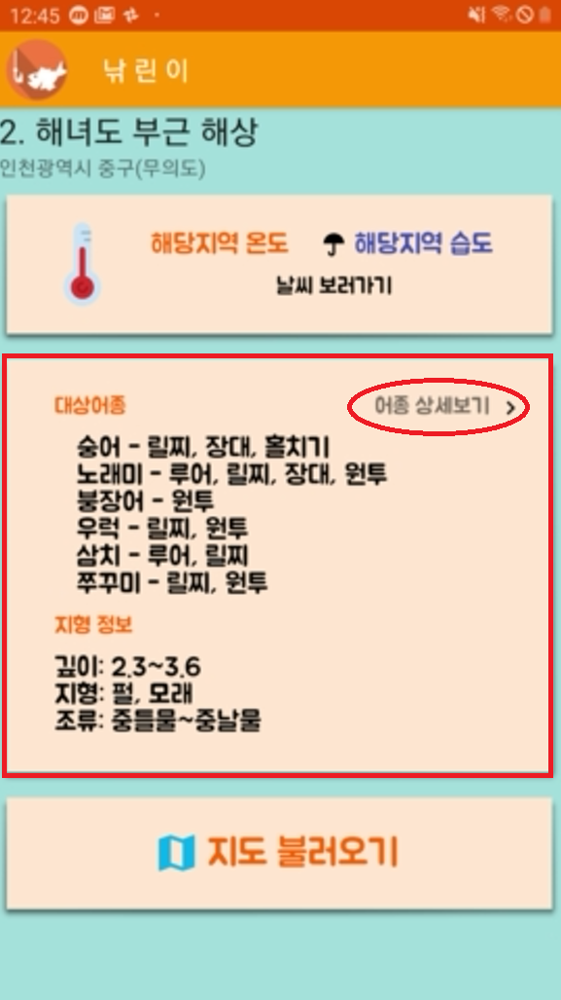
    
    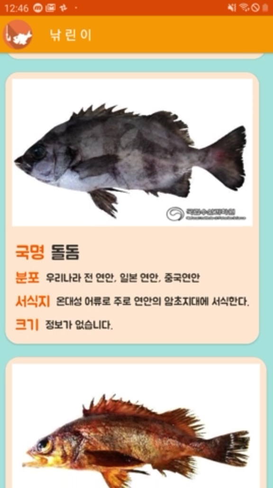
    
    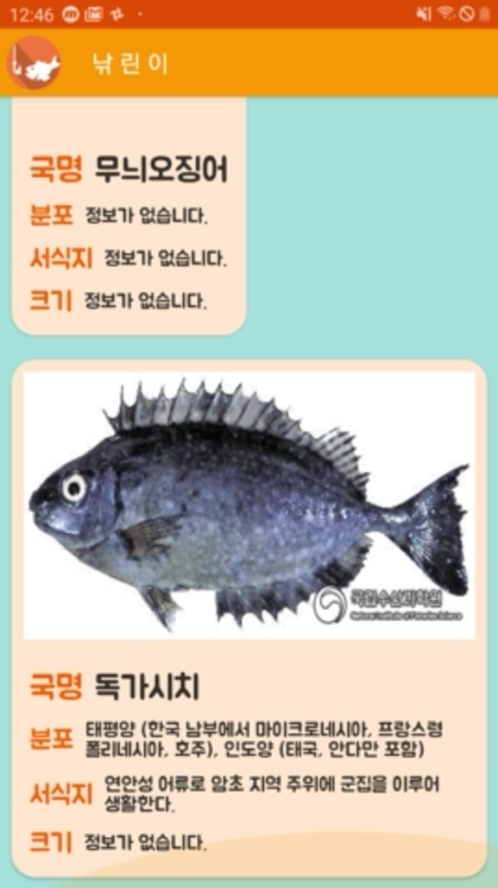
    
## 5. 최종발표
https://github.com/sonic247897/T4IR_Naklini_PJT 팀 프로젝트 소스코드
https://github.com/sonic247897/fishingApp-project/tree/master/fishingApp-R 전처리 코드(인코딩, 크롤링)

​    
